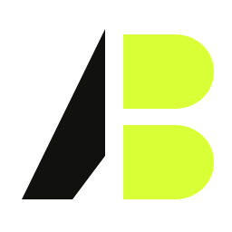
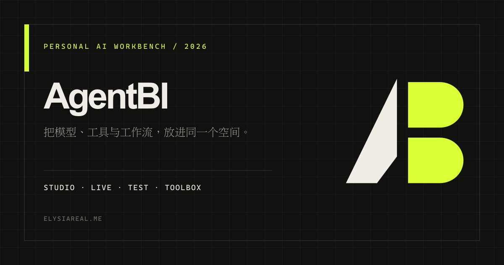
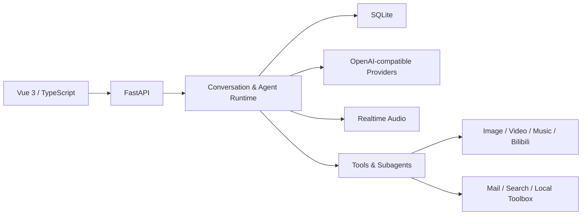

<div align="center">



# AgentBI

**一个为个人工作流构建的多模型 AI 工作台。**

Studio、实时语音、测试实验室与实用工具共享同一套本地身份、模型配置和数据底座。


[项目网站](http://elysiareal.me/) · `LOCAL FIRST` · `MULTI MODEL` · `AGENT READY`

</div>



---

## 工作空间

| 模块 | 定位 | 当前能力 |
| --- | --- | --- |
| **Studio** | 完整的 LLM 对话工作台 | 多供应商、流式响应、消息分支、助手、记忆、RAG、多模态附件、工具与子代理 |
| **Live** | 实时语音交互空间 | 流式语音、实时字幕、用户打断、角色与音色、通话历史和角色记忆 |
| **Test** | 结构化测试实验室 | 知识测试、趣味测试、结构化出题、自动分析、结果归档与重测 |
| **Toolbox** | 独立的小型生产工具 | TTS 对比、表情包制作、萌娘百科归档、文件时间管理与自动输入 |

## 核心结构



### 对话与上下文

- 基于消息 DAG 的编辑、重试、版本切换和会话分支。
- 可切换滚动窗口与后台上下文压缩，原始消息始终完整保留。
- 助手级长期记忆、历史会话向量检索和可配置的模型路由。
- OpenAI 兼容接口统一接入，并按模型能力处理视觉输入与推理摘要。

### 能力系统

- 原子工具与子代理统一注册，助手按需挂载能力。
- 邮件、网易云音乐、哔哩哔哩、Tavily 搜索等专项模块。
- Lite / Pro 图像生成，以及 Agnes / Seedance 异步视频生成。
- 工具事件、正文和子代理过程按照真实时间线穿插展示。

### 本地数据

- 用户、助手、会话、消息、记忆、测试和能力配置统一存储于 SQLite。
- 上传附件与生成资产由本地附件库管理。
- 环境变量、数据库、日志、构建产物和本地参考资料均排除在 Git 之外。

## 技术栈

| 层级 | 技术 |
| --- | --- |
| Web | Vue 3、TypeScript、Vite、Pinia |
| API | Python、FastAPI、Pydantic、httpx |
| Storage | SQLite、本地附件存储、向量检索 |
| AI | OpenAI-compatible API、Qwen Audio Realtime、Codex OAuth Image |
| Integrations | 网易云音乐、Bilibili、Tavily、Agnes、火山方舟 |

## 本地运行

```powershell
# Backend · http://127.0.0.1:8000
Copy-Item AgentBI/.env.example AgentBI/.env
.\venv\python.exe -m AgentBI.main

# Frontend · http://localhost:5173
Set-Location Agent-vue
npm install
npm run dev
```

模型、邮箱及第三方能力通过 `AgentBI/.env` 与应用内配置页维护。该仓库用于个人持续开发，不面向公共部署。
