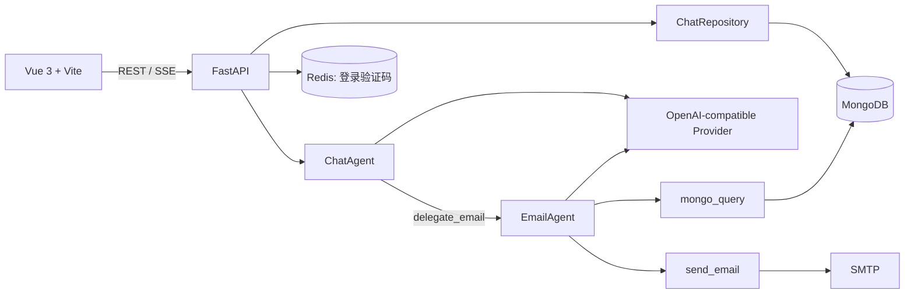

# AgentBI 开发总览

> 更新日期：2026-07-14  
> 当前阶段：一期聊天工作台、OpenAI-compatible 接入、Mongo 消息 DAG、邮件子代理编排已落地。

## 1. 项目定位

AgentBI 是一个前后端分离的智能体工作台。用户通过邮箱作为一期 `user_id` 进入聊天页，在同一界面中管理会话、选择 OpenAI-compatible 提供商和模型、查看流式回复及工具执行过程。

当前不实现账号权限、密钥加密或用量治理；这些属于后续工程化阶段。

## 2. 技术架构



### 核心边界

- 浏览器只调用 AgentBI，不直接访问模型提供商。
- `ChatAgent` 是当前主会话编排器，只注册 `delegate_email`，不直接执行 Mongo 查询或邮件发送。
- `EmailAgent` 负责收件人查询、邮件撰写和 SMTP 发送，可调用 `mongo_query` 与 `send_email`。
- `tools/` 放置原子能力；跨步骤业务流程放在 `agents/`。
- API 层将 Agent 事件转换为 SSE，并把时间线写入消息记录。

## 3. 项目结构

```text
PythonProject5/
├─ Agent-vue/                         # Vue 3 前端
│  └─ src/
│     ├─ api/                         # REST/SSE 客户端与 TS 类型
│     ├─ stores/                      # auth、chat 状态与偏好恢复
│     ├─ router/                      # 路由和登录守卫
│     └─ views/                       # 聊天页、模型配置页、登录页
├─ AgentBI/                           # FastAPI 后端
│  ├─ main.py                         # 生命周期、Mongo 初始化、路由注册
│  ├─ tests/                          # unittest 回归测试
│  └─ src/
│     ├─ agents/                      # ChatAgent、EmailAgent、LoginAgent
│     ├─ api/                         # chat、conversations、providers 等路由
│     ├─ repositories/                # MongoDB 读写
│     ├─ schemas/                     # Pydantic 请求/响应契约
│     ├─ services/                    # 上下文、SSE、时间线、模型发现
│     └─ tools/                       # mongo_query、send_email 等原子工具
├─ code/                              # 旧示例模块，仅作能力/流程参考
└─ docs/                              # 项目文档
```

## 4. 已实现功能

### 聊天与会话

- 会话创建、删除、历史加载、消息持久化。
- 页面刷新后自动加载历史会话；优先恢复上次打开的会话，找不到时打开最新会话。
- 会话消息采用 `parent_id` 邻接表 DAG；上下文只从 `active_message_id` 回溯的选中链截取，不混入其他版本。
- 支持助手重试版本、用户消息编辑后重新生成、版本箭头切换，以及从任意消息创建独立分支会话。
- OpenAI-compatible 流式调用，前端逐段渲染正文与推理摘要。
- 回复时间线按实际顺序展示并存储：正文、工具开始、工具结果、子代理、后续正文可交错出现。
- 模型调用失败会持久化为错误消息，而不是让临时回复消失。

### 提供商与偏好

- 提供商配置：名称、`base_url`、API Key、默认模型、模型列表刷新。
- 从 `<base_url>/models` 获取并规范化模型 ID。
- 前端可选择提供商、模型、温度和上下文轮次。
- 用户偏好保存在 MongoDB `chat_preferences`，刷新后按 `user_id` 恢复。
- 旧会话没有偏好记录时，聊天页会以自动打开的历史会话配置作为迁移兜底。

### Agent 与工具

- `ChatAgent` 通过 `delegate_email` 将邮件任务转交给 `EmailAgent`。
- `EmailAgent` 可先查询 `users` 集合中的 `username` / `email`，再生成和发送邮件。
- `send_email` 复用现有 SMTP 配置。
- `mongo_query` 与 `send_email` 保持为可独立调用的原子 Tool。

### 登录

- 保留原有邮箱验证码、Redis 缓存和登录流程。
- 一期将登录邮箱保存到浏览器本地，并作为聊天数据归属的 `user_id`。

## 5. MongoDB 数据模型

| 集合 | 用途 | 关键字段 |
|---|---|---|
| `provider_profiles` | 模型提供商配置 | `name`、`base_url`、`api_key`、`default_model`、`available_models` |
| `chat_preferences` | 用户全局聊天偏好 | `user_id`、`provider_id`、`model`、`temperature`、`context_turns` |
| `chat_threads` | 会话元数据与活跃分支指针 | `user_id`、标题、模型配置、`active_message_id`、来源会话/消息 |
| `chat_messages` | 消息 DAG 节点 | `thread_id`、`parent_id`、`role`、`content`、版本组、时间线、模型快照 |
| `chat_runs` | 每次助手生成的运行快照 | `message_id`、提供商/模型/温度/上下文快照、状态、时间戳 |
| `conversations` / `messages` | 一期旧数据 | 保留，不再由新代码读取或写入 |

现有索引：

- `chat_preferences(user_id)` 唯一索引
- `chat_threads(user_id, last_message_at)`
- `chat_messages(thread_id, parent_id, created_at)`
- `chat_runs(thread_id, message_id)` 唯一索引

## 6. API 摘要

| 方法 | 路径 | 用途 |
|---|---|---|
| `POST` | `/chat/stream` | 发起 SSE 聊天流 |
| `GET/PUT` | `/chat/preferences?user_id=...` | 获取/保存用户聊天偏好 |
| `GET/POST/PATCH/DELETE` | `/conversations...` | 会话与消息管理 |
| `GET/POST/PATCH/DELETE` | `/providers...` | 提供商管理 |
| `POST` | `/providers/{id}/refresh-models` | 同步模型列表 |
| `POST` | `/send_code`、`/login` | 原有登录验证码流程 |

`POST /chat/stream` 的 SSE 事件包括：`message_start`、`delta`、`reasoning_summary`、`tool_started`、`tool_finished`、`done`、`error`。

## 7. 当前进度

| 工作项 | 状态 |
|---|---|
| Git 仓库初始化 | 已完成，本地尚未建立提交 |
| Vue 聊天工作台与现代化布局 | 已完成 |
| 消息 DAG、版本控制、分支会话 Mongo 持久化 | 已完成 |
| OpenAI-compatible 多提供商与模型选择 | 已完成 |
| 用户偏好持久化与活跃会话恢复 | 已完成 |
| 邮件子代理编排 | 已完成一期实现 |
| 后端核心 unittest | 已完成，当前 12 项 |
| 真实 Provider / SMTP 全链路验收 | 待执行 |
| 浏览器视觉 QA | 待执行 |

## 8. 后续方向

### P0：稳定性与完整执行循环

1. 为每个子代理增加真实 Provider、Mongo、SMTP 集成测试。
2. 让中断按钮向服务端传播取消信号，停止上游模型流。
3. 为邮件发送增加结构化结果，明确区分“未找到收件人”“发送失败”“发送成功”。
4. 给长任务增加运行 ID、步骤状态和可恢复错误记录。

### P1：领域子代理

1. `OfficeAgent`：Word、Excel、PPTX 创建、编辑、渲染验证和产物返回。
2. `DatabaseAgent`：面向数据分析/写入任务的受控查询与结果整理。
3. `MediaAgent`：图片/视频生成任务、进度和产物卡片。
4. 引入集中 AgentRegistry，替代主 Agent 内部硬编码分发。

### P2：工程化

1. 会话/JWT、API Key 加密、权限与审计。
2. Provider 调用限流、用量统计、重试和可观测性。
3. 长任务队列、Docker Compose、CI、数据库迁移。

## 9. 本地运行与验证

后端：

```powershell
.\venv\python.exe -m uvicorn AgentBI.main:app --reload
```

前端：

```powershell
cd Agent-vue
npm run dev
```

回归验证：

```powershell
.\venv\python.exe -m unittest discover -s AgentBI\tests -v
cd Agent-vue
npm run type-check
npm run build-only
```
