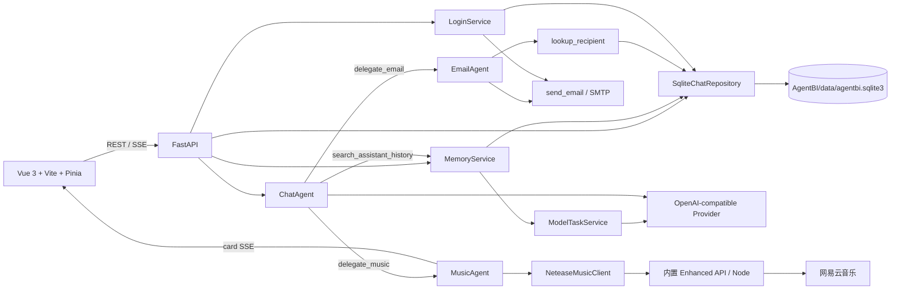

# AgentBI 开发总览

> 更新日期：2026-07-15
> 当前阶段：本地 SQLite 驱动的聊天工作台、消息 DAG、助手记忆/历史检索/上下文压缩、后台模型路由与网易云音乐子代理已落地。

## 1. 当前架构



- 浏览器只访问 FastAPI；模型 API Key 与 SMTP 配置仅由后端使用。
- `SqliteChatRepository` 是当前唯一的业务持久化边界：用户、验证码、提供商、偏好、助手、会话、消息 DAG 与运行记录均保存在 SQLite。
- `ChatAgent` 只暴露已挂载能力的委派入口，例如 `delegate_email`、`delegate_music`；并仅在助手启用历史检索时暴露 `search_assistant_history`。后者由模型按需调用，不会逐轮强制检索。
- `MemoryService` 负责助手核心记忆、历史向量索引、上下文压缩与首轮标题；`ModelTaskService` 复用提供商配置执行四类后台模型任务。
- 流式调用使用 OpenAI-compatible Chat Completions；正文、推理摘要、工具和通用 `card` SSE 事件按真实发生顺序写入消息时间线。

## 2. 目录与模块

```text
Agent-vue/
  src/api/             REST 与 SSE 客户端、类型
  src/stores/          登录态、聊天态、共享播放器、持久化偏好
  src/views/           首页、登录、聊天、配置、助手管理
  src/components/      模型头像、音乐卡片与通用界面组件

AgentBI/
  main.py              FastAPI 生命周期、SQLite 与内置 Node 子进程初始化
  data/agentbi.sqlite3 本地开发数据库（运行时生成，未纳入 Git）
  src/api/             登录、资料、聊天、会话、提供商、助手路由
  src/repositories/    SQLite 数据访问实现
  src/services/        LoginService、上下文/记忆、后台模型任务、SSE、模型发现、音乐 API 客户端与进程管理
  src/agents/          ChatAgent、EmailAgent、MusicAgent、助手能力注册
  src/tools/           SMTP 邮件与网易云音乐原子能力
  src/schemas/         Pydantic 请求/响应模型
  tests/               unittest 回归测试
  vendor/netease-music-api/  固定版本 Enhanced API 包装器与 npm lock
```

## 3. 本地数据模型

| 表 | 用途 |
| --- | --- |
| `users` | 规范化用户身份、用户名、邮箱、持久化头像 |
| `login_codes` | 单次、带过期时间的邮箱验证码 |
| `provider_profiles` | OpenAI-compatible 端点与模型列表 |
| `chat_preferences` | 用户模型、温度、上下文轮次偏好 |
| `assistants` | 默认/自定义助手、提示词、能力挂载、头像与环境变量开关 |
| `model_routes` | 每个用户的向量、压缩、记忆、标题模型分工 |
| `assistant_memories` | 每个用户与助手的一份可编辑核心记忆 |
| `message_embeddings` | 同助手历史消息的本地向量索引 |
| `chat_threads` | 会话元数据、当前活跃分支、所用助手与压缩摘要缓存 |
| `chat_messages` | 用 `parent_id` 表示的不可变消息 DAG、版本组和时间线 |
| `chat_runs` | 单次生成的配置快照和状态 |

`CHAT_SQLITE_PATH` 可覆盖默认库路径；未设置时使用 `AgentBI/data/agentbi.sqlite3`。开发阶段不导入或兼容旧 MongoDB 数据。

## 4. 已实现能力

- 邮箱验证码登录：已注册用户可通过用户名或邮箱登录；首次以邮箱验证后自动创建用户。成功响应返回规范化 `user_id`，前端以其作为所有数据归属。
- 用户资料：用户名、邮箱与头像都保存在 `users` 表；头像上传跨刷新保留。
- 多提供商模型配置：保存端点、密钥、默认模型；可从 `/models` 同步模型列表，并分别选择聊天、向量、压缩、记忆与标题模型。
- 会话与版本：新建、重命名、删除、编辑用户消息、重试助手消息、版本切换和从任意节点创建分支会话。
- 上下文：支持滚动窗口与总结压缩两种策略。压缩只改变模型请求，不删除消息；切回滚动窗口会立即忽略摘要。摘要锚点不属于当前 DAG 分支时不会注入。
- 助手：默认助手挂载所有已注册能力；自定义助手可设置提示词、头像和启用能力，且会话列表按助手隔离。两者都可配置记忆间隔、历史检索阈值/条数及压缩阈值。
- 跨会话记忆：每个用户、每个助手维护一份核心记忆，按配置轮次后台更新；管理页可查看、编辑、清空或手动提炼。
- 历史会话 RAG：同助手消息经 OpenAI-compatible Embeddings 建立索引；仅在模型主动调用工具时执行语义检索，并排除当前会话。
- 自动标题：首轮用户与助手消息完成后，由独立轻量模型生成标题，不再截取用户原文作为会话名。
- 邮件子代理：主代理委派后，子代理仅可查询 SQLite 中的收件人并调用 SMTP 发送，不再直接访问 MongoDB 或通用查询工具。
- 音乐子代理：固定 Cookie 模式下支持歌曲搜索、每日推荐与精确点播；Node 服务随 FastAPI 无感启停，失败时仅降级音乐能力。歌曲卡片持久化稳定元数据，播放时经 `/music/tracks/{id}/stream` 即时解析 URL。
- 前端体验：流式正文/推理摘要、按时间线交错的工具与卡片事件、共享音乐播放器、模型头像、个人头像与本地偏好恢复。

## 5. 已移除的开发期依赖

- Redis 登录验证码缓存
- LLM 驱动的 `LoginAgent`
- MongoDB 聊天/用户目录与通用 `mongo_query` 工具

当前仍不包含公网安全设计（会话鉴权、密钥加密、权限隔离、速率限制）；这些应在对外部署前补齐。

## 6. 后续方向

1. AgentRegistry：在现有统一注册与延迟工厂基础上，继续补齐 Office、数据库、媒体等子代理的输入/输出契约、生命周期依赖与可观测性。
2. Playground / Live：复用会话 DAG、角色与提示词模块化能力，分别承载 RP 场景和实时语音模型。
3. 本地优先同步：保留 `SqliteChatRepository` 作为接口边界；需要云同步时实现新的 repository，而不是让 API 层直接耦合数据库。
4. 生产化：加密 provider key、认证与权限、审计、模型调用限流、后台任务与备份/迁移。

后台能力采用“缺少路由即跳过”的降级方式：未配置向量/压缩/记忆/标题模型不会影响聊天模型正常回复。

## 7. 本地运行与验证

```powershell
# 后端（项目根目录）
npm install --prefix AgentBI/vendor/netease-music-api
.\venv\python.exe -m uvicorn AgentBI.main:app --reload

# 前端
cd Agent-vue
npm run dev

# 后端回归
cd ..
.\venv\python.exe -m unittest discover -s AgentBI\tests -v

# 前端
cd Agent-vue
npm run type-check
npm run build
```

网易云音乐配置位于 `AgentBI/.env`：复制 `.env.example` 后填写 `NCM_COOKIE`。Cookie 只由 Python 内部客户端作为请求头发送，不写入 SQLite、SSE 或前端；失效时更新该值并重启后端。可用 `NCM_AUDIO_LEVEL` 调整音质等级，默认 `standard`。

## 8. Bilibili 视频子代理

- 能力 ID：`agent.bilibili`；主助手委派入口：`delegate_bilibili`。
- 子代理只暴露 `search_videos` 与 `get_video_detail`，不处理登录、点赞、投币、收藏或评论。
- 搜索通过本机 `bilibili-cli` 的结构化 JSON 输出完成，后端强制 UTF-8 并使用无窗口子进程；它不是常驻服务。详情使用公开详情接口补齐封面、简介、时长与播放量。
- 搜索结果以 `bilibili.video-list` 或 `bilibili.video` 卡片写入消息时间线。卡片只保存 BV 号和稳定元数据，不保存 Cookie 或临时视频流地址。
- 点击卡片后，前端在聊天工作台上方打开哔哩哔哩官方内嵌播放器；播放失败时可通过卡片或播放器标题栏跳转官方视频页。

首次使用前安装 CLI：

```powershell
uv tool install bilibili-cli
bili search "Python 教程" --type video --max 1 --json
```

默认命令为 `bili`，需要指定其他可执行文件时在 `AgentBI/.env` 设置 `BILI_CLI_COMMAND`。Windows 后端会自动设置 `PYTHONUTF8=1` 与 `PYTHONIOENCODING=utf-8`，无需单独修改系统编码。
