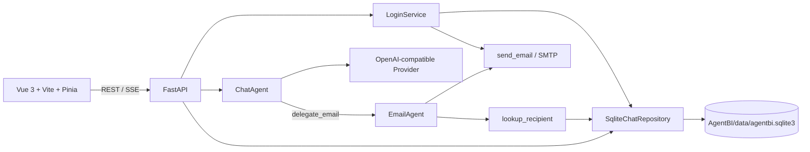

# AgentBI 开发总览

> 更新日期：2026-07-15
> 当前阶段：本地 SQLite 驱动的聊天工作台、消息 DAG、助手模块与邮件子代理已落地。

## 1. 当前架构



- 浏览器只访问 FastAPI；模型 API Key 与 SMTP 配置仅由后端使用。
- `SqliteChatRepository` 是当前唯一的业务持久化边界：用户、验证码、提供商、偏好、助手、会话、消息 DAG 与运行记录均保存在 SQLite。
- `ChatAgent` 只暴露 `delegate_email`。收件人检索、邮件撰写和 SMTP 发送由 `EmailAgent` 完成；主会话没有通用数据查询工具。
- 流式调用使用 OpenAI-compatible Chat Completions；SSE 事件按真实发生顺序写入消息时间线。

## 2. 目录与模块

```text
Agent-vue/
  src/api/             REST 与 SSE 客户端、类型
  src/stores/          登录态、聊天态、持久化偏好
  src/views/           首页、登录、聊天、配置、助手管理
  src/components/      模型头像与通用界面组件

AgentBI/
  main.py              FastAPI 生命周期与 SQLite 初始化
  data/agentbi.sqlite3 本地开发数据库（运行时生成，未纳入 Git）
  src/api/             登录、资料、聊天、会话、提供商、助手路由
  src/repositories/    SQLite 数据访问实现
  src/services/        LoginService、上下文构建、SSE、模型发现
  src/agents/          ChatAgent、EmailAgent、助手能力注册
  src/tools/           SMTP 邮件原子能力
  src/schemas/         Pydantic 请求/响应模型
  tests/               unittest 回归测试
```

## 3. 本地数据模型

| 表 | 用途 |
| --- | --- |
| `users` | 规范化用户身份、用户名、邮箱、持久化头像 |
| `login_codes` | 单次、带过期时间的邮箱验证码 |
| `provider_profiles` | OpenAI-compatible 端点与模型列表 |
| `chat_preferences` | 用户模型、温度、上下文轮次偏好 |
| `assistants` | 默认/自定义助手、提示词、能力挂载、头像与环境变量开关 |
| `chat_threads` | 会话元数据、当前活跃分支与所用助手 |
| `chat_messages` | 用 `parent_id` 表示的不可变消息 DAG、版本组和时间线 |
| `chat_runs` | 单次生成的配置快照和状态 |

`CHAT_SQLITE_PATH` 可覆盖默认库路径；未设置时使用 `AgentBI/data/agentbi.sqlite3`。开发阶段不导入或兼容旧 MongoDB 数据。

## 4. 已实现能力

- 邮箱验证码登录：已注册用户可通过用户名或邮箱登录；首次以邮箱验证后自动创建用户。成功响应返回规范化 `user_id`，前端以其作为所有数据归属。
- 用户资料：用户名、邮箱与头像都保存在 `users` 表；头像上传跨刷新保留。
- 多提供商模型配置：保存端点、密钥、默认模型；可从 `/models` 同步模型列表。
- 会话与版本：新建、重命名、删除、编辑用户消息、重试助手消息、版本切换和从任意节点创建分支会话。
- 上下文：从当前活跃链截取指定轮次；可由助手配置决定是否注入时间、时区、语言和用户名等运行环境变量。
- 助手：默认助手挂载所有已注册能力；自定义助手可设置提示词、头像和启用能力，且会话列表按助手隔离。
- 邮件子代理：主代理委派后，子代理仅可查询 SQLite 中的收件人并调用 SMTP 发送，不再直接访问 MongoDB 或通用查询工具。
- 前端体验：流式正文/推理摘要、按时间线交错的工具事件、模型头像、个人头像与本地偏好恢复。

## 5. 已移除的开发期依赖

- Redis 登录验证码缓存
- LLM 驱动的 `LoginAgent`
- MongoDB 聊天/用户目录与通用 `mongo_query` 工具

当前仍不包含公网安全设计（会话鉴权、密钥加密、权限隔离、速率限制）；这些应在对外部署前补齐。

## 6. 后续方向

1. AgentRegistry：将邮件、Office、数据库、媒体等子代理统一注册，提供能力元数据、输入/输出契约与可观测性。
2. Playground / Live：复用会话 DAG、角色与提示词模块化能力，分别承载 RP 场景和实时语音模型。
3. 本地优先同步：保留 `SqliteChatRepository` 作为接口边界；需要云同步时实现新的 repository，而不是让 API 层直接耦合数据库。
4. 生产化：加密 provider key、认证与权限、审计、模型调用限流、后台任务与备份/迁移。

## 7. 本地运行与验证

```powershell
# 后端（项目根目录）
.\venv\python.exe -m uvicorn AgentBI.main:app --reload

# 前端
cd Agent-vue
npm run dev

# 后端回归
cd ..
.\venv\python.exe -m unittest discover -s AgentBI\tests -v

# 前端
cd Agent-vue
npm run type-check
npm run build
```
