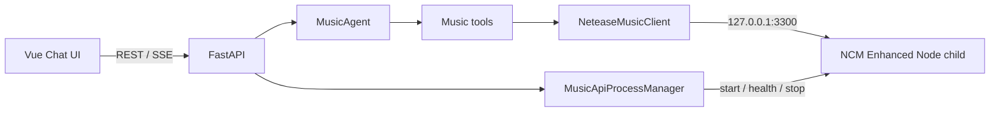

# 网易云音乐子代理设计

## 目标

在 AgentBI 内增加可挂载的网易云音乐子代理，支持固定账号的每日推荐、歌曲搜索和点歌，并把可交互音乐卡片按真实时间线推送到当前对话窗口。

一期必须保持单项目启动体验：用户只启动 AgentBI 后端，内置的 Node API 服务由 FastAPI 生命周期无感拉起和回收，不要求手动打开第二个终端。

## 范围

一期包含：

- 固定网易云 Cookie。
- 搜索歌曲。
- 获取每日推荐歌曲。
- 根据歌曲 ID 获取详情与最新播放地址。
- 单曲播放器卡片和歌曲列表卡片。
- 卡片 SSE 推送、消息时间线持久化与历史恢复。
- 默认助手自动挂载音乐能力，自定义助手可选择挂载。

一期不包含：

- 扫码登录和用户级网易云账号绑定。
- 红心、收藏、评论、歌单修改和听歌打卡。
- 歌词滚动、下载、跨页面播放器和离线缓存。
- 在数据库中持久化有时效的播放 URL。

## 上游实现

采用 `NeteaseCloudMusicApiEnhanced/api-enhanced`，而不是已经归档的 `Binaryify/NeteaseCloudMusicApi`。Enhanced API 作为锁定版本的项目内 Node 依赖运行，对 Python 侧只暴露本机 HTTP 接口。

- Enhanced API: <https://github.com/NeteaseCloudMusicApiEnhanced/api-enhanced>
- npm: <https://www.npmjs.com/package/@neteasecloudmusicapienhanced/api>
- 原项目归档状态: <https://github.com/Binaryify/NeteaseCloudMusicApi>

所有上游差异都封装在 `NeteaseMusicClient` 内。MusicAgent、API 路由和前端卡片不得依赖上游原始响应字段。

## 进程架构



`MusicApiProcessManager` 由 FastAPI lifespan 持有：

1. 检查功能开关、Node 可执行文件和项目内依赖。
2. 检查内部端口，避免热重载重复启动。
3. 直接执行 `node app.js`，不经过 `npm` 或 shell。
4. Windows 使用隐藏窗口和独立进程组。
5. 将 stdout/stderr 转发到 AgentBI 日志。
6. 在限定时间内轮询健康接口。
7. 健康检查成功后标记音乐能力可用。
8. FastAPI 退出时先 terminate，超时后 kill。

Node 启动失败不得阻止 FastAPI 启动。运行时异常退出后，下一次音乐请求最多自动重启一次，禁止无限重启循环。

## 后端模块

```text
AgentBI/
  vendor/netease-music-api/          Node Enhanced API 与锁定依赖
  src/services/music_api_process.py  子进程生命周期与健康状态
  src/services/netease_music_client.py
  src/agents/music_agent.py
  src/tools/music_tools.py
  src/api/music.py
  src/schemas/music_schema.py
```

### NeteaseMusicClient

负责：

- 附加固定 Cookie。
- 设置请求超时。
- 调用搜索、日推、歌曲详情和播放地址接口。
- 把上游响应转换成项目内固定 schema。
- 将 Cookie 失效、无版权、VIP 限制和上游故障转换成明确异常。

统一歌曲结构：

```json
{
  "id": "33894312",
  "name": "歌曲名",
  "artists": ["歌手"],
  "album": "专辑",
  "cover_url": "https://...",
  "duration_ms": 240000,
  "available": true,
  "unavailable_reason": null
}
```

### MusicAgent

能力 ID 为 `agent.music`，主代理只拥有 `delegate_music`，不得直接访问网易云工具。

MusicAgent 复用当前对话模型，但只挂载：

- `search_tracks(query, limit)`
- `daily_recommendations(limit)`
- `resolve_track(track_id)`

主代理将原始音乐请求委派给 MusicAgent。MusicAgent 判断搜索、日推或点歌意图，并返回普通文本与零个或多个卡片事件。无搜索结果时只返回文本，不生成空卡片。

## 通用卡片协议

新增通用时间线事件 `card`，不增加音乐专属 SSE 事件：

```json
{
  "type": "card",
  "kind": "music.track-list",
  "payload": {
    "title": "今日推荐",
    "tracks": []
  }
}
```

一期支持：

- `music.track`：单曲播放器卡片。
- `music.track-list`：搜索候选或每日推荐列表。

`card` 事件必须：

- 按工具和正文真实发生顺序进入 SSE。
- 原样保存到 `chat_messages.timeline`。
- 会话重新加载时恢复。
- 不包含 Cookie、内部 API 地址或有时效的播放 URL。

该协议以后由图片、Office、数据库结果等模块复用。

## 播放流程

卡片只保存稳定歌曲元数据。点击播放时：

1. 前端调用 `GET /music/tracks/{track_id}/stream`。
2. Python 后端使用固定 Cookie 即时获取新的播放 URL。
3. 后端返回重定向或明确的不可播放状态。
4. 前端共享的单播放器实例开始播放，并暂停此前歌曲。

搜索不确定时最多返回三首候选。每日推荐默认返回十首，可在卡片内展开。播放 URL 不写入消息、SQLite 或长期前端状态。

## 前端模块

```text
Agent-vue/src/
  components/cards/MusicTrackCard.vue
  components/cards/MusicTrackListCard.vue
  stores/player.ts
  api/music.ts
```

聊天时间线根据 `card.kind` 分派组件。未知 kind 显示安全的降级卡片，不得导致整条消息渲染失败。

播放器一期只在聊天工作台范围内共享；切换对话时允许继续播放，离开工作台后停止。卡片显示封面、歌曲名、歌手、专辑、时长、播放状态和不可播放原因。

## 配置

```dotenv
NCM_ENABLED=true
NCM_COOKIE=固定账号 Cookie
NCM_API_PORT=3300
NCM_AUDIO_LEVEL=standard
NCM_STARTUP_TIMEOUT_SECONDS=15
```

Cookie 只存在于后端环境变量和发往内部 Node 服务的请求中，不进入 SQLite、日志、SSE 或前端。

## 失败处理

- Node 不可用：音乐工具返回“音乐服务暂不可用”，主聊天继续运行。
- Cookie 失效：返回可识别错误，卡片显示登录失效，不泄露 Cookie。
- 无版权、VIP 或地区限制：歌曲元数据仍可显示，播放按钮禁用。
- 播放地址过期：点击时重新获取。
- 搜索无结果：返回文本提示。
- 未知上游响应：客户端记录去敏日志并返回稳定错误结构。
- 子进程异常退出：单次自动重启失败后保持禁用，等待下一次后端启动。

## 测试

后端测试覆盖：

- Node 子进程启动、健康检查、端口复用与退出回收。
- Cookie 传递和去敏保证。
- 搜索、日推、歌曲详情、播放地址的响应标准化。
- MusicAgent 工具白名单和主代理委派。
- card 事件顺序、SSE 编码、时间线持久化和历史恢复。
- 上游失败不终止主聊天。

前端测试覆盖：

- card kind 分派和未知类型降级。
- 单播放器切歌互斥。
- 不可播放歌曲状态。
- 历史卡片恢复后按歌曲 ID 延迟获取播放地址。

所有自动化测试使用假 Node 服务或假 HTTP 响应，不访问真实网易云账号。

## 验收标准

- 只启动 AgentBI 后端即可自动获得音乐能力，不出现额外终端窗口。
- 默认助手可响应“今天日推”“搜索某首歌”“播放某首歌”。
- 日推与搜索结果以卡片穿插在当前消息时间线中。
- 点击可播放歌曲时获取最新地址并播放，同一时间只有一个音频实例。
- 刷新或重新进入会话后卡片仍存在。
- 音乐服务、Cookie 或版权异常不会导致主聊天流失败。
- Cookie 不出现在浏览器请求内容、SQLite 和普通日志中。
