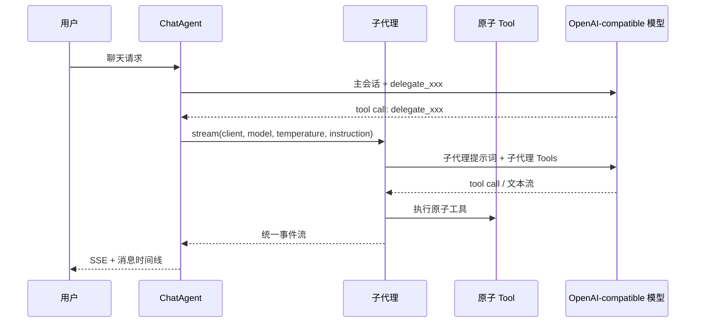

# AgentBI 子代理模块开发说明

> 面向：项目维护者、编码代理和新增领域能力的开发者。  
> 目标：在不破坏现有 SSE、会话历史和模型选择链路的前提下，为 AgentBI 新增可编排的子代理。

## 1. 当前编排模型

当前系统由 `assistant_registry.py` 统一注册能力元数据、`delegate_*` 工具定义、显示名称、依赖类型与代理工厂。`ChatAgent` 只按注册表解析委派名称，不再为每个领域编写一组路由 `if/else`。



现有示例：

- 主编排器：[ChatAgent](../AgentBI/src/agents/chat_agent.py)
- 邮件子代理：[EmailAgent](../AgentBI/src/agents/email_agent.py)
- 音乐子代理：[MusicAgent](../AgentBI/src/agents/music_agent.py)
- 原子工具：[send_email_tool.py](../AgentBI/src/tools/send_email_tool.py)、[music_tools.py](../AgentBI/src/tools/music_tools.py)

## 2. 职责划分

### 主 Agent

- 面向用户维持主会话。
- 只暴露“委派型工具”，例如 `delegate_email`、`delegate_office`。
- 选择子代理并把用户原始请求、必要上下文传给子代理。
- 不应重复实现子代理内部的数据库、文件或第三方服务调用。

### 子 Agent

- 拥有明确领域职责和独立系统提示词。
- 注册完成该领域任务所需的原子工具。
- 自行处理“模型调用工具 → 工具结果回传模型 → 最终文本”的循环。
- 返回与主会话相同的事件格式。

### 原子 Tool

- 只做一个可复用动作，例如查询业务数据库、发邮件、写入 Excel、生成图片。
- 输入通过 Pydantic schema 约束。
- 返回可给模型阅读的短文本或结构化可序列化数据。
- 不负责决定流程顺序，不直接操作 SSE 或前端状态。

## 3. 统一事件协议

子代理必须通过异步生成器产出字典事件。当前 API 层会识别如下事件：

| `type` | 必填字段 | 含义 |
|---|---|---|
| `delta` | `content` | 正文增量 |
| `reasoning_summary` | `content` | 可展示的推理摘要，不是原始内部思维链 |
| `tool_started` | `tool` | 原子工具或子代理开始 |
| `tool_finished` | `tool`，可选 `content` | 工具/子代理结束及结果摘要 |
| `card` | `kind`、`payload` | 可持久化的通用产物卡片；例如 `music.track-list` |

`done`、`error`、`message_start` 由 `api/chat.py` 负责产生。不要让子代理自行持久化消息或自行输出 SSE 字符串。

事件会被 `append_timeline_event()` 写入 `messages.timeline`，前端按该数组的顺序渲染。因此不要把工具事件攒到任务结束后一次性输出。

## 4. 新增子代理的标准步骤

### 第一步：确定边界

先写一句可测试的职责描述，例如：

> `OfficeAgent` 负责根据用户要求创建或编辑 Office 文件，调用文件与 Office 原子工具，返回产物摘要；不负责直接查询业务数据库或发送邮件。

不要把“查询、发邮件、生成文件、更新数据库”全部塞进一个没有边界的万能 Agent。

### 第二步：创建原子工具

位置：`AgentBI/src/tools/`。

```python
# AgentBI/src/tools/create_report_tool.py
from langchain_core.tools import tool

@tool("create_report")
def create_report(title: str, body: str) -> str:
    """创建报告文件，并返回产物路径或简短失败原因。"""
    # 调用实际 Office/文件服务
    return "报告已创建：..."
```

复杂入参应先在 `AgentBI/src/schemas/` 新建 Pydantic schema，再通过 `args_schema` 绑定到 Tool。

### 第三步：创建子代理

位置：`AgentBI/src/agents/<domain>_agent.py`。

必须复用主 Agent 传入的 `AsyncOpenAI` client、`model`、`temperature`。不要在子代理中读取 `.env` 重建模型客户端，否则会绕过前端当前选择的提供商和模型。

```python
from collections.abc import AsyncIterator
from typing import Any
from openai import AsyncOpenAI

class OfficeAgent:
    system_prompt = "你是 Office 子代理，只处理 Office 文档任务。"

    @staticmethod
    def tool_definitions() -> list[dict[str, Any]]:
        return [{
            "type": "function",
            "function": {
                "name": "create_report",
                "description": "创建 Office 报告。",
                "parameters": {
                    "type": "object",
                    "properties": {
                        "title": {"type": "string"},
                        "body": {"type": "string"},
                    },
                    "required": ["title", "body"],
                },
            },
        }]

    async def stream(
        self,
        client: AsyncOpenAI,
        model: str,
        temperature: float,
        instruction: str,
    ) -> AsyncIterator[dict[str, Any]]:
        # 参照 EmailAgent：流式读取 chunk，累计 tool_calls，
        # 发送 tool_started/tool_finished，并将 tool result 作为 role=tool 回传模型。
        yield {"type": "delta", "content": ""}
```

实际实现请以 `EmailAgent.stream()` 的工具循环为基准；模板中的空 `delta` 只用于说明事件形状，不能保留在生产代码中。

### 第四步：在统一注册表登记子代理

在 `assistant_registry.py` 的 `SUBAGENTS` 中增加 `SubagentRegistration`。注册表会自动生成主模型可见的委派工具，并按需延迟导入代理类；不要修改 `ChatAgent._stream_tool_loop()`。

```python
SubagentRegistration(
    capability_id="agent.office",
    display_name="Office 子代理",
    description="创建或编辑 Office 文件。",
    prompt="需要处理 Office 文件时，调用 delegate_office。",
    delegate_name="delegate_office",
    delegate_description="将 Office 文件任务委派给 Office 子代理。",
    task_label="Office 任务",
    dependency="office_service",
    agent_module="AgentBI.src.agents.office_agent",
    agent_class_name="OfficeAgent",
)
```

如果新增了依赖类型，还需扩展 `create_subagent()` 的依赖映射，并在 FastAPI 生命周期创建该服务；代理分发逻辑本身无需变化。

### 第五步：准备委派上下文

主 Agent 应传递：

- 用户原始请求；
- 模型生成的委派说明；
- 本轮已经完成的、与子代理有关的 Tool 结果。

不要传 API Key、SMTP 密码或无关的完整聊天记录。`ChatAgent._delegated_instruction()` 是当前的参考实现。

## 5. 工具循环约束

正确循环：

```text
模型流 → 收集 tool_calls → 发送 tool_started → 执行 Tool
→ 发送 tool_finished → 追加 role=tool 消息 → 再次调用模型 → 最终正文
```

以下做法会导致任务在“查到数据”后停住，禁止使用：

```text
模型调用 Tool → 执行 Tool → 直接结束流
```

邮件子代理已经实现了完整循环，可作为所有工具型子代理的基线。

## 6. 持久化与前端显示

- `api/chat.py` 负责把事件写入 `messages.timeline`。
- 前端 `ChatView.vue` 按时间线渲染，能显示“正文 → 工具 → 正文”的交错顺序。
- 子代理若产生文件，应先返回简短路径/摘要；需要前端产物卡片时复用 `card`，为新的 `kind` 增加渲染组件，不要再创造领域专属 SSE 事件。
- `payload` 只保存稳定元数据。临时下载地址、播放 URL、Cookie、API Key 等不得持久化；参考音乐卡片通过稳定歌曲 ID 在点击时解析播放地址。
- 历史消息必须能只依靠 SQLite `chat_messages.timeline` 回放，不依赖浏览器内存。

## 7. 测试要求

新增子代理至少补充以下测试：

1. `tool_definitions()` 只暴露该子代理需要的 Tool。
2. 主 Agent 暴露对应的 `delegate_<domain>`，而不暴露子代理内部 Tool。
3. 子代理工具循环能把 Tool 结果回传给第二轮模型调用。
4. 子代理事件顺序可以被 `append_timeline_event()` 正确持久化。
5. 至少一个失败路径：工具异常、缺少关键输入或上游模型异常。

测试放在 `AgentBI/tests/test_<domain>_agent.py`，执行：

```powershell
.\venv\python.exe -m unittest discover -s AgentBI\tests -v
```

前端涉及新事件类型时，同时执行：

```powershell
cd Agent-vue
npm run type-check
npm run build-only
```

## 8. 旧 `code/` 目录的使用规则

`code/03-邮件发送智能体.py`、`code/04-邮件发送助手.py`、`code/05-Mongo智能体.py` 可作为提示词、工具编排和领域流程的参考。

不要直接把这些脚本 import 到运行时，原因：

- 它们是演示入口，不是可复用服务模块；
- 会重新通过 `.env` 创建模型，忽略前端选择的 Provider/Model；
- 部分路径和人设文件依赖演示环境；
- 顶层包名 `code` 与 Python 标准库模块同名，直接导入有冲突风险。

正确做法是迁移其领域提示词和流程意图，在 `AgentBI/src/agents/` 中按本说明重建。

## 9. 当前限制与演进建议

- 当前注册表的依赖槽仍为项目内显式映射；能力规模继续增长时可升级为应用级依赖容器。
- 子代理执行仍在 Web 请求内；Office 渲染、视频生成等长任务应改为任务队列。
- 当前无鉴权和权限隔离；不要把此阶段的 Tool 边界误认为安全边界。
- 长生命周期、可恢复的子代理服务应由 `app.state` 管理，注册表只负责描述和创建代理，不负责持有外部资源。
